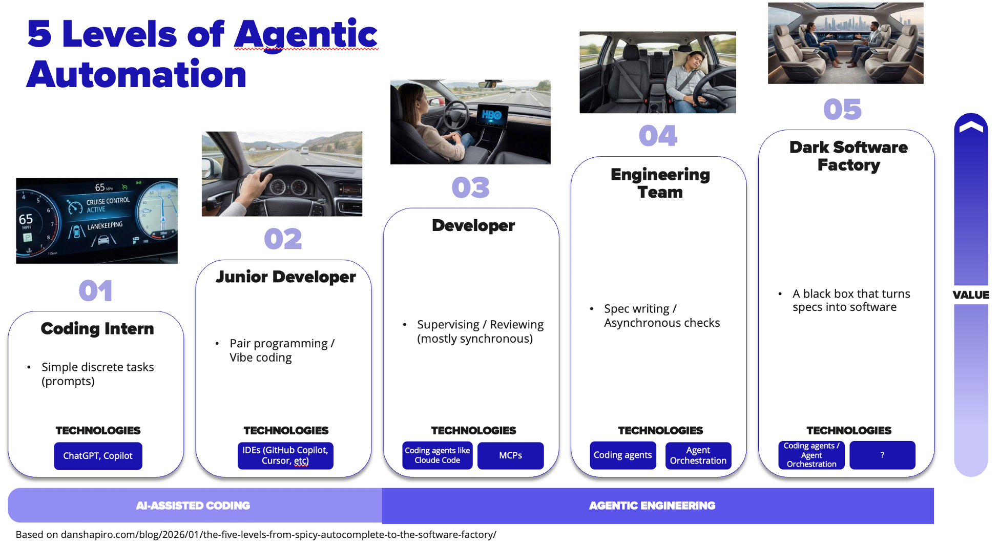
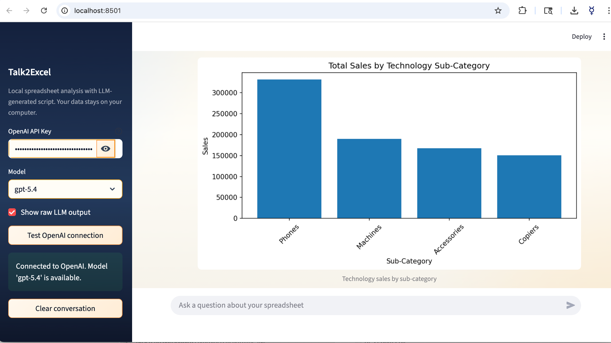
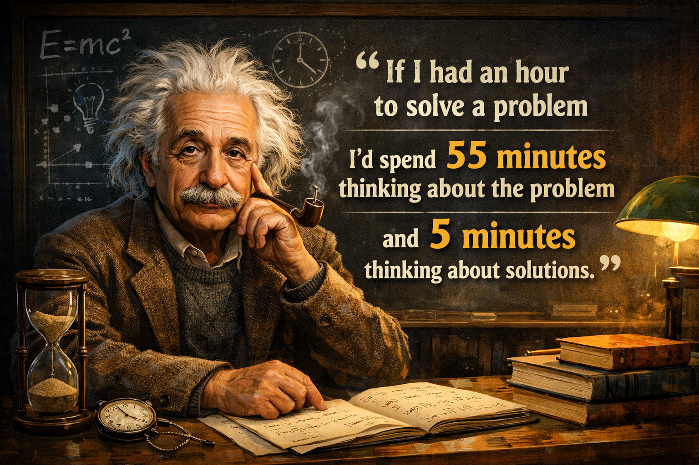

# dark-software-factory
Tests and benchmarks to address one simple question: Dark Software Factory - how far are we from it?

Inspired by Dan Shapiro’s article [The Five Levels: From Spicy Autocomplete to the Software Factory](https://www.danshapiro.com/blog/2026/01/the-five-levels-from-spicy-autocomplete-to-the-software-factory/) (via the [@NateBJones podcast](https://www.youtube.com/@NateBJones)), this project explores a simple but fascinating question:

> **How far are we from the Dark Software Factory — a black box that turns specs into production software?**

## The Five Levels of Agentic Automation
Below is the conceptual ladder from AI-assisted coding to fully autonomous software generation.



Quick summary:

| Level                         | Description                                         | Human Role                                       |
| ----------------------------- | --------------------------------------------------- | ------------------------------------------------ |
| **1 — Coding Intern**         | AI helps with small prompts and tasks               | Direct prompting                                 |
| **2 — Junior Developer**      | Pair programming with AI                            | Continuous interaction                           |
| **3 — Developer**             | AI writes code, humans review                       | Mostly synchronous supervision                   |
| **4 — Engineering Team**      | Spec-driven development with automated checks       | Humans define specs with implementation guidance |
| **5 — Dark Software Factory** | A black box that turns specifications into software | Humans define what, not how                      |

This project tests whether we can reliably operate somewhere between Level 4 and Level 5.

## The Experiment

To test the reliability of **specification-driven development**, here is a simple challenge:

### Build a small application called **Talk2Excel**

The app allows users to:

- Upload large Excel files  
- Ask questions in natural language  
- Analyze data **locally** without uploading sensitive data to an LLM  

Instead of sending the data to the model, the system works like this:

```text
User question
    ↓
Prompt (user question + spreadsheet schema)
    ↓
LLM generates Python code
    ↓
Python runs locally on the dataframe
    ↓
Results returned to user
```

Here is a screenshot of the application for illustration:



## App Inspiration

The idea for this app was inspired by Andrew Ng’s course: https://learn.deeplearning.ai/courses/agentic-ai/

Highly recommended.

**Spoiler alert:** you'll learn how rigorous evals are what separate top-performing teams from average ones.

## The Spec-Driven Approach

Instead of interactive coding via prompts, we provide coding agents with a [complete specification](baseline/requirements.md).

The spec includes:
- Product requirements
- Technical constraints / Implementation guidance
- Acceptance criteria (test cases)
  
Some people might argue that this is Level 4 Agentic Engineering, since the acceptance criteria effectively define the tests.

A true Level 5 Dark Software Factory would go one step further and generate the tests automatically from the PRD.

And honestly… I agree.

But for the sake of this experiment - and to keep the agents from fully taking over just yet we’ll treat this as Level 4-ish :)

## Build Instructions

If you want to replicate the experiment, the input files are available in the [baseline](baseline) directory.  
It contains the requirements, a test dataset (XLS file) as well as the code for a small prototype written in **Jupyter** (which is always a good choice for quick prototyping).

The prototype code is referenced in the specification under the Technical Constraints / Implementation Guidance section.

Just open it in your favorite environment (Cursor, VS Code with Codex or Claude Code, or these agents in the terminal) and type something like:

> Read requirements.md and follow its guidance to build the Talk2Excel application.

## The Key Mechanism — Build → Test → Fix Loop

The spec is written for asynchronous autonomous execution.
The agent runs the following loop:

1. Build the application
2. Run automated tests
3. Fix failures
4. Repeat

This loop continues until **all acceptance tests pass**.

No human supervision required.

If you'd like to repeat the experiment, enable **automatic approval of agent actions**.

*(Naturally, this is at your own risk - agents are surprisingly enthusiastic once they realize nobody is watching)*

## Evaluation (The Most Important Part)

Following Andrew Ng's advice:

> **Eval is king.**

The evaluation criteria are purely objective.

### The build must:

- ✅ Pass all test cases  
- ✅ Pass the Ruff static code checker  
- ✅ Follow technical constraints  
- ✅ Avoid shortcuts (like hardcoding answers)

## Preventing "Cheating"

One critical element in the spec is the **Technical Constraints / Implementation Guide**, which explicitly warns agents not to shortcut the system.

For example:

> **Important:**  
> LLM must be used in end-to-end UI testing — do not bypass behavior with deterministic hard-coded logic.

Without such instructions, agents sometimes try to **“game” the evaluation**.

Yes - it turns out AI developers can be just as creative with requirements as human collegues… especially when trying to make the tests pass.

## Results

The repository contains two builds:

- **Codex 5.4** output  
- **Claude Code 4.6 Opus** output  

Each agent received the same specification.

The comparison focuses on:

- Time to completion
- Test reliability  
- Spec adherence  
- Creative solutioning (if any)

### 🏁 Build Comparison

| Metric | Codex 5.4 | Claude Code 4.6 Opus |
|---|---|---|
| Execution Time | ~36 min | ~17 min |
| Lines of Code Added | 1,195 | 451 |
| Files Created / Modified | 8 | 2 |
| Retry / Failed Iterations | 8 | 2 |
| Acceptance Tests | ✅ PASS | ✅ PASS |
| Ruff Static Check | ✅ PASS | ✅ PASS |
| Architecture | Modular package for portability/reuse | Single Streamlit app |
| Security Controls | Code validation + import blocking | Minimal safeguards |
| Implementation Style | Robust, defensive | Lean, pragmatic |

**My take on the agent personalities:**  
*(would be great to hear other folks’ opinions):*

> **Codex 5.4 — Methodical Overachiever**  
> The diligent intermediate engineer who stayed late at the office to make sure the assignment is fully completed.

> **Claude Code 4.6 Opus — Efficient Minimalist**  
> The laid-back senior engineer who finishes the task quickly and clearly has hobbies outside of programming.

*Disclaimer: The above is a psychological metaphor, not a hiring strategy! Today’s agents lack the adaptability and judgment of humans - so the winning formula remains simple: human engineers with agents.*

## Takeaways

Both agents successfully completed the test. Interestingly, it took **longer to write the specification than for the agents to produce the code**, which leads to a provocative conclusion: we may already be much closer to the Dark Software Factory than we think.

Of course, real-world projects with large codebases and complex dependencies are significantly harder to delegate to agents without close supervision.

However, the capability frontier is moving quickly. The effective intelligence of LLM systems appears to be **roughly doubling every ~7 months** (see [METR Time Horizons](https://metr.org/time-horizons/)).

In this small experiment, the agents autonomously implemented a **complete user story from specification to tested code**, without human supervision - a task that would likely take a human developer at least a day or a few, even in full vibe-coding mode.

## 🧠 The New Bottleneck: Human Thinking

When implementation becomes trivial and the **cost of change approaches zero**  (as discussed in [Kim Adams — *Outliving Boehm's Curve*](https://www.linkedin.com/pulse/outliving-boehms-curve-kim-adams-2iilc/)), the real challenge in engineering shifts toward **defining the right problem to solve**.

<p align="center">
  
</p>

And at least for now, humans still decide what is worth building in the first place ;)
